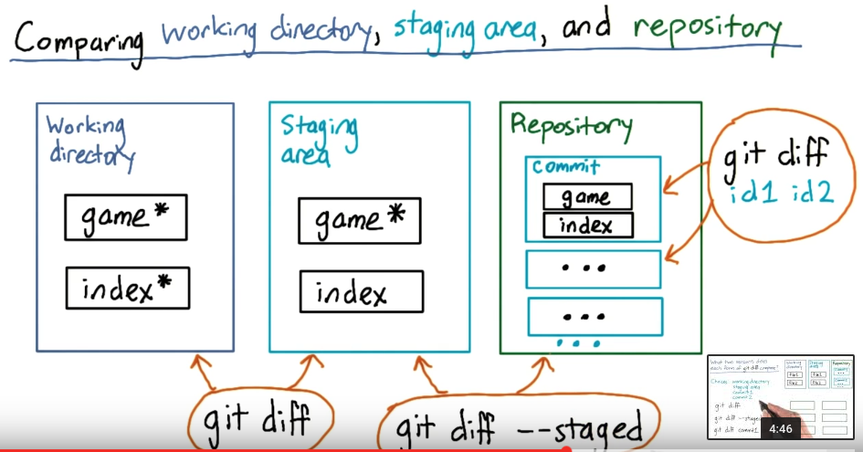
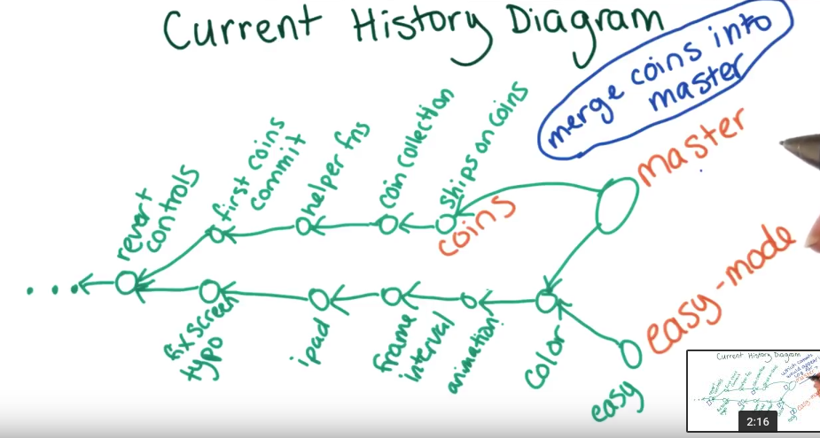
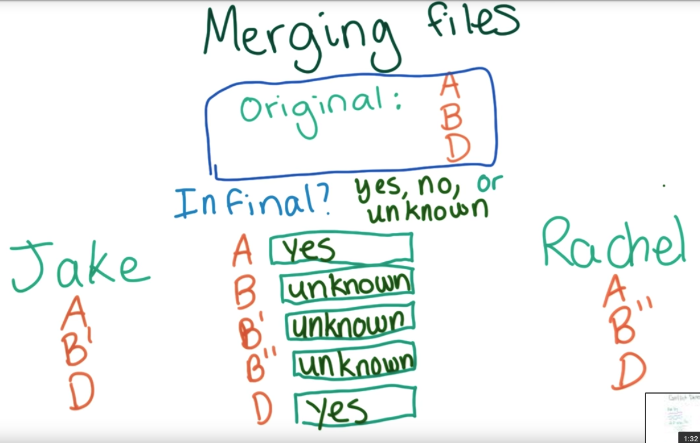
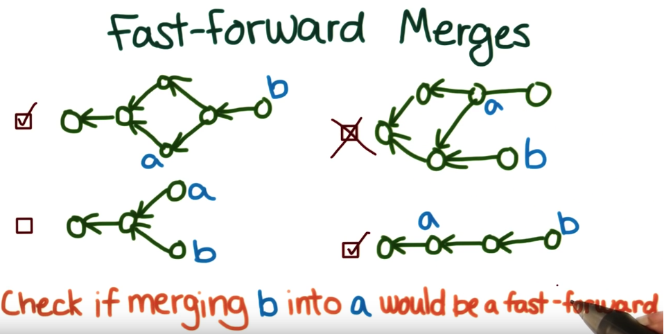
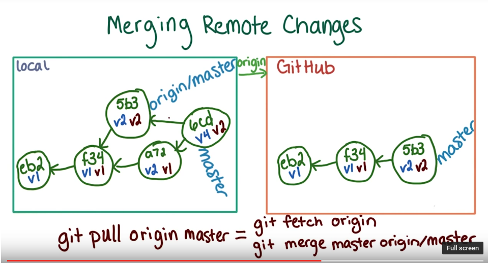
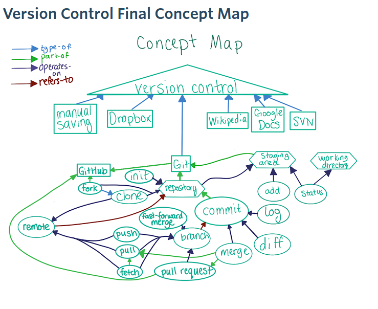

## Git and Github ##

### Git Concepts ###

**Commit**: is a snapshot of `staging area` then copying/merging it to local repository.  

**Working Directory**: Local directory  
**Staging Area**: This is virtual directory which sits between repository and working directory. We `git add` file to staging area. This helps to separate unwanted files or changes to be committed in `repository`.  
**Repository**: This is repository in a local. It can be linked to multiple remote repository. This is neat because without internet connection. we can basically `commit` and use git, then later `push` changes to remote for cloud storage.  



**History**  
See repository commit history with command `git log [options]`. Each commit has a commit ID. We can switch to any commit by `git checkout {commitID}`

  

**Merge**: We can work on branch and while merging, we find the differences between branch and resolve the conflicts. This diagram shows how `git` decides to keep changes or flag the conflict.  


**Fast Forward Merge**  
If the merging commit have a common ancestor and is reachable, then it is fast forward merge. Merging can be smooth in fast forward merge.  



**Push**: Updating remote repository with all the commit history.  


**Concept Map**  
Here is the full concepts map of `git` topics.  Find a  [Concept map org](https://www.udacity.com/wiki/ud775/concept-map?nocache)



[Git training **cheat sheet**  :concepts and its subsequent Commands](https://github.com/github/training-kit/blob/master/downloads/github-git-concepts_BETA.md)  


### Git Commands ###

`git init`                              #initialize a repository on current directory. creates hidden `.git` folder.  
`git clone {httpAddress.git}`           #clone and download files/commit history and everything from repository  


`git log  [--stat]`                                  # to see git commit logs [with statistics]  
`git log [--oneline]`                                # see log with 'short commit id' and 'message'  
`git log --graph --oneline <branchname1> <branchname2>` # see graphically commit logs with its history in simple line.  
`git checkout {commitID}`                       # to go back to the old **temporary** version/commit , not equal to SVN checkout  
`git diff [-u] {oldfile.js} {newfile.js}`        # to see the difference between the old and new commits. you can type first **4 or more characters** of commit ID.  
`git diff`   #compare working directory vs staging area  
`git diff --staged` #compare staged area with repository  
`git status`                                    #show if any files need to be added to staging area or is awaiting `commit`  

`git add/rm {filepath/filename}`  # add given files to `staging area`
`git add *.png`  #add all .png files  

`git commit -m '{commit message}'`  #get a snapshot of files and add it to local repository.  
> A good rule of thumb is to make _one commit per logical change_.  

[Git commit message guide](http://udacity.github.io/git-styleguide/) 


`git reset --hard`  #to remove any changes in working directory and staging area and get all files from repository. **Careful: this is irreversible command.**    
`git branch  [-a]`     # see available branches , [-a] shows hidden branches with origin/remoteMastersinceLastPullPush  
`git branch '<branchname>'` # create a branch with <branchname>  
`git checkout -b <branchname>` # create a branchname and checkout to it.  
`git branch -d <branchname>` # delete the label of branch, only do this after the merge process  
`git checkout <branchname>` # switch to branchname.  

`git remote` #check remote repositories  
`git remote add <remoteNametobeCalledInThisLocal> <remoteRepoUrl>`   # add and give name to remote repository.  
`git remote -v` # see verbose remote repositories.  
> **`git push/pull <remote_repo_name[usally origin]> <branch_name_to_push>`** #pull or pull branch to remote repo on `git pull <origin> <master>`, if both local and remote are out of sync, it will fetch and merge!  


`git fetch <remoteRepoName_usually_origin>` #update local <origin/master> from repo like Github.   


### Merge conflict ###
If you get a merge conflict then the file will have what conflicts shown in the file.
```
<<<<<<< HEAD   
code in heads
|||||||| share common ansestors
code in common anseteros means code in shared parents 
=======
code in masters
>>>>>>> masters
```
+ have to remove those HEAD and other comments
+ figure out which thing should be in the final files[merge repo]
+ after modified conflicts, add on stage then commit with commit message.
+ merge will be complete after _resolving the conflict_.


### Fast - forward Merge ###
a <--- b <--- c

Fast forward merge happens, if b is merged with a, when `a` can be reached by b. `git pull` update local HEAD and merge the difference in branch.  
in the case of fast-forward merge it doesn't create another commit for merge, since they share the same ancestor.

**Note**: github will create another commit if done from the browser.


### Pull Request ###
think of this as, user is requesting to pull his/her change to 'main branch/master'. This is **github** command.

### Behavior of `git checkout` ###
> Checking out an earlier commit will change the state of at least one file.
>
> This is sometimes true. Git doesn't allow you to save a new commit if no files have been updated, so you might think this is always true. However, it's possible to do the following:
>
> Save a commit (call this commit 1).
> Update some files and save another commit (call this commit 2).
> Change all the files back to their state during commit 1, then save again (call this commit 3).
> This sometimes happens if commit 2 contained a bug, and it's important to fix the bug quickly. The easiest thing to do might be to remove all the changes introduced by commit 2 to fix the bug, then figure out how to safely reintroduce the changes later.
> 
> At this point, commit 3 is the latest commit, so if you checkout commit 1, none of the files will be changed. 
> 
> 
> Checking out an earlier commit will change the state of more than one file.
> 
> Checking out an earlier commit will change the state of every file in the repository.
> 
> Both of these are sometimes true. Since each commit tracks the state of all files in the repository, it is possible that checking out an earlier commit will change the state of multiple files, or even all the files in the repository. However, it is possible to save a new commit after changing only one file, so it is possible only one file will change. 
> 
> 
> After checking out a commit, the state of all the files in the repository will be from the same point in time.
> 
> This is always true. **A commit saves a snapshot of all files in the repository at the time the commit was made**, so checking out an  earlier commit will result in all the files being reverted to their state at the time the commit was made. That is, the files will  be in a consistent state.


### Linux Commands ###

`pwd`  # print working directory  
`ls`  # list the files in this directory  
`ls -a` ## show all files including hidden files  

`rm [-r] <folder/filename>`   ## remove directory/folder/file [-r: recursive to its subfiles, used to clean direcotry]   
`mv <sourcefilepath> <destinationfilepath/name>`    ## move files from folder to folder with given name. Note source file will be moved and renamed.   